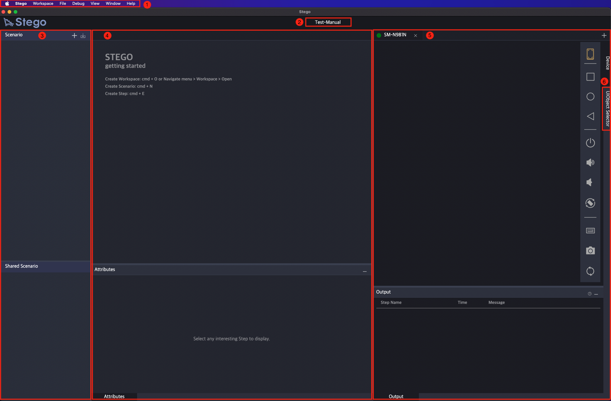

# 기본 화면 구성

Stego를 실행하면 아래와 같이 6가지 요소로 구성된 화면이 뜹니다.

<figure><figcaption></figcaption></figure>

#### (1) 메뉴바

메뉴바에는 Stego에서 제공하는 대부분의 기능들이 분류되어 있습니다.


[menubar.md](menubar.md)


#### (2) 워크스페이스&#x20;

신규 또는 읽어들인  워크스페이스의 이름이 표시 됩니다.


[undefined-2.md](undefined-2.md)


**(3) 시나리오 관리**

워크스페이스에 포함된 시나리오를 관리할 수 있는 곳입니다. \
새로운 시나리오를 만들고 수정하거나 삭제할 수 있습니다. 또한 이미 작성해두었던 시나리오를 다른 시나리오에 포함 시킬 수 있는 공유 시나리오를 관리 할 수 있고, 내보내기 했던 시나리오를 불러올 수 있습니다.


[scenario.md](scenario.md)


**(4) 시나리오 작성 패널**

시나리오를 작성 및 수정하고 실행할 수 있습니다.


[Broken link](broken-reference)


#### (5) 디바이스

디바이스 패널 에서는 디바이스를 연결 및 해제할 수 있으며, 연결된 디바이스의 이름이 표시됩니다. 그리고 연결된 디바이스의 미러링된 화면을 조작하거나 AI Vision 엔진에서 받은 화면 분석 결과를 확인 할 수 있습니다.


[devices.md](devices.md)


#### (6) 화면 분석 도구 (UIObject Selector)

화면 분석 도구는 다양한 AI Vision 기술을 이용해 화면을 분석해서 사용자에게 화면을 구성하고 있는 여러가지 요소(아이콘, 텍스트, 선택창 등)들을 제공해주는 역할을 합니다.\
사용자는 화면을 구성하고 있는 요소들 중 액션을 수행할 요소를 선택하게 됩니다.


[Broken link](broken-reference)

