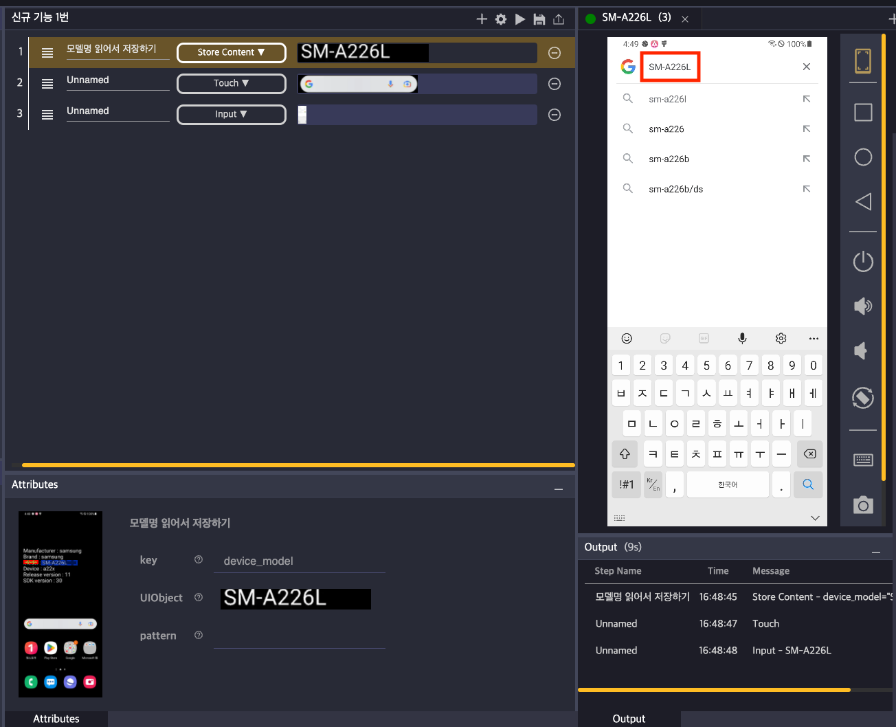

# 예제3. 특정 위치 단어 확인

### 바탕화면에 있는 스마트폰 모델명을 읽어서 검색창에서 검색하기

<mark style="background-color:green;">Step1.</mark> 새 스텝을 만들고 "Store Content"액션을 선택합니다.

<figure><figcaption></figcaption></figure>

<mark style="background-color:green;">Step2.</mark> 화면 분석 후 분석 도구로 "OCR"을 선택합니다.

<figure><figcaption></figcaption></figure>

<mark style="background-color:green;">Step3.</mark> 화면에서 "Model"을 선택한 다음, 화면 분석 도구에서 "Relative"를 선택하고 Model 옆에 있는 모델명 부분을 드래그&드롭으로 선택 후 스텝의 UIObject로 추가합니다.

<figure><figcaption></figcaption></figure>

<figure><figcaption></figcaption></figure>

<mark style="background-color:green;">Step4.</mark> Stego에 연결된 디바이스 바탕화면의 검색창을 클릭하는 스텝을 만들고, input 스텝을 만든 다음 input 액션  attributes의 value에 ${device\_model} 입력합니다.&#x20;

<figure><figcaption></figcaption></figure>

최종 결과. 디바이스를 초기 화면으로 바꾸고 시나리오를 실행하여 검색어 입력란에 Store Content 스텝에서 설정한 값이 입력된 것을 확인합니다.

<figure><figcaption></figcaption></figure>
